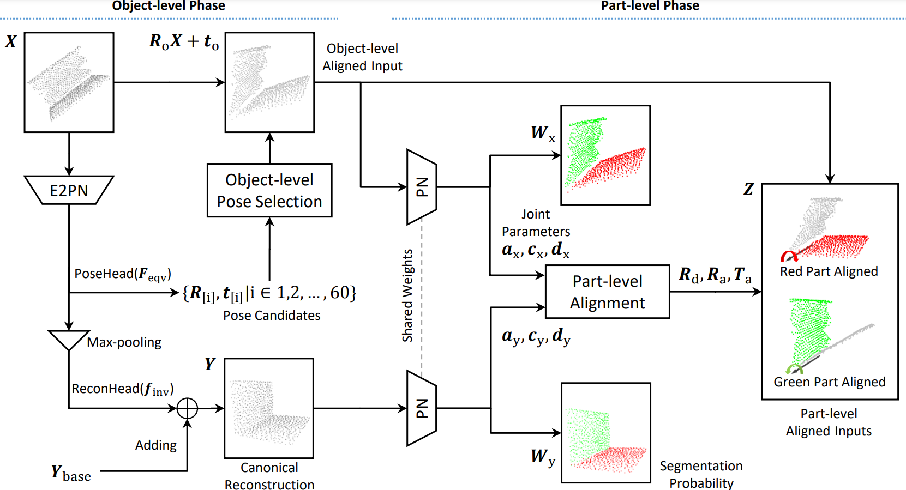
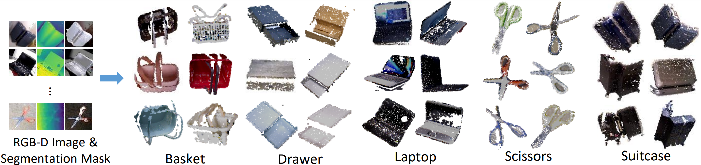

# OP-Align: Object-level and Part-level Alignment for Self-supvervised Category-level Articulated Object Pose Estimation
OP-Align is a model designed for category-level articulated object pose esimation task with self-supervised learning.
This repo contains the code of OP-Align model and our real-word dataset.

You can find our paper [here](https://arxiv.org/abs/2408.16547).



If you find the code or dataset useful for your research, please cite our paper.
```
@inproceedings{che2024op,
  title={OP-Align: Object-level and Part-level Alignment for Self-supvervised Category-level Articulated Object Pose Estimation},
  author={Che, Yuchen and Furukawa, Ryo and Kanezaki, Asako},
  booktitle={European Conference on Computer Vision},
  year={2024},
  organization={Springer}
}
```

## Dataset

We provide a novel real-world dataset for category-level Articulated Object Pose Estimation task.
You can download our dataset from [here](https://drive.google.com/file/d/1rfbVkHj8Uu0fmtuGDQGjUFi5oV86uWcb/view).

Each *.npz files contains point cloud captured from a single-view RGB-D camera. To visualize the data based on image format, reshape array into (480,640,-1).
- pc (307200, 3) # 480 * 640 * xyz
- color (307200, 3) # 480 * 640 * rgb
- detection (307200,) # 480 * 640, maskRCNN/SAM result
- segmentation (307200,) # 480 * 640, segmentation GT, 0 indicates background
- part (2, 15) # P * (9+3+3), per-part rotation, translation, scale
- joint (1, 6) # J * (3+3), per-joint direction, pivot

We also provide the HOI4D part of the synthetic dataset at [here](https://drive.google.com/file/d/1xJw6K4RefEejBEth2i4wHyEPTYyBeWUJ/view?usp=sharing). Refer to [EAP](https://github.com/Meowuu7/equi-articulated-pose) for more details. To run this dataset, add ```--dataset-type Light``` at the end of training/testing script, and change ```--shape-type``` into ```laptop_h``` or ```safe```.

## Enviroment
OP-Align uses a similar enviroment with [E2PN](https://github.com/minghanz/E2PN/tree/main) and adds [PyTorch3D](https://pytorch3d.org/) module.
```
conda env create -f OP_environment.yml
conda activate OP
conda install -c fvcore -c iopath -c conda-forge fvcore iopath
pip install "git+https://github.com/facebookresearch/pytorch3d.git"
cd vgtk; python setup.py build_ext --inplace; cd ..
mkdir log
ln -s <dataset_location> dataset
```
Finanlly, we also provide the trained model weights at [here](https://drive.google.com/file/d/1E_SyEni5IRZ6bMoyDFo4Y2rLHsPMkQxZ/view?usp=drive_link). You can download and unzip them at `log` folder.

## Running Script
Each category has different joint settings. Specifically, `--shape-type` indicates the category, `--nmask` indicates the number of parts, `--njoints` indicates the number of joints, `--rotation-range` indicates the limitation or joint movement and `--joint-type` indicates whether the joint is a revolute or prismatic joint. See `SPConvNets/options.py` for more details.

There should have a .csv file been generated at `log/experiment-id` folder after the testing, which contains the accuracy for each test instance.
### Training
```
python run_art.py train experiment --experiment-id <Any_Name_You_like> --run-mode train equi_settings --shape-type basket_output --nmasks 3 --njoints 2 model --rotation-range 120 --joint-type r

python run_art.py train experiment --experiment-id <Any_Name_You_like> --run-mode train equi_settings --shape-type drawer_output --nmasks 2 --njoints 1 model --rotation-range 120 --joint-type p

python run_art.py train experiment --experiment-id <Any_Name_You_like> --run-mode train equi_settings --shape-type laptop_output --nmasks 2 --njoints 1 model --rotation-range 120 --joint-type r

python run_art.py train experiment --experiment-id <Any_Name_You_like> --run-mode train equi_settings --shape-type suitcase_output --nmasks 2 --njoints 1 model --rotation-range 120 --joint-type r

python run_art.py train experiment --experiment-id <Any_Name_You_like> --run-mode train equi_settings --shape-type scissor_output --nmasks 2 --njoints 1 model --rotation-range 120 --joint-type r
```

### Testing
```
python run_art.py train --resume-path <The_Path_of_PTH_File> experiment --experiment-id <Any_Name_You_like> --run-mode test equi_settings --shape-type basket_output --nmasks 3 --njoints 2 model --rotation-range 120 --joint-type r

python run_art.py train --resume-path <The_Path_of_PTH_File> experiment --experiment-id <Any_Name_You_like> --run-mode test equi_settings --shape-type drawer_output --nmasks 2 --njoints 1 model --rotation-range 120 --joint-type p

python run_art.py train --resume-path <The_Path_of_PTH_File> experiment --experiment-id <Any_Name_You_like> --run-mode test equi_settings --shape-type laptop_output --nmasks 2 --njoints 1 model --rotation-range 120 --joint-type r

python run_art.py train --resume-path <The_Path_of_PTH_File> experiment --experiment-id <Any_Name_You_like> --run-mode test equi_settings --shape-type suitcase_output --nmasks 2 --njoints 1 model --rotation-range 120 --joint-type r

python run_art.py train --resume-path <The_Path_of_PTH_File> experiment --experiment-id <Any_Name_You_like> --run-mode test equi_settings --shape-type scissor_output --nmasks 2 --njoints 1 model --rotation-range 120 --joint-type r
```

# Acknowledgments
Our code is developed based on open-sourced existing works [E2PN](https://github.com/minghanz/E2PN/tree/main) and [EAP](https://github.com/Meowuu7/equi-articulated-pose). Thanks for their great works.